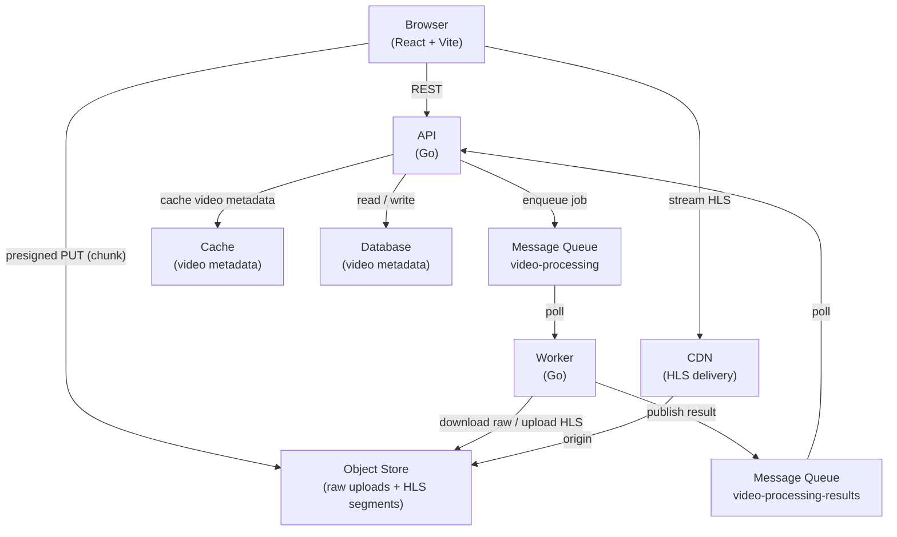

# design-youtube

A YouTube-like video platform built as a portfolio project to explore system design at scale.

Clients upload videos through a REST API. Chunks go directly to object storage via presigned multipart URLs. A background worker picks up each completed upload, transcodes it to HLS at three resolutions, and publishes the result back to the API. Viewers stream the HLS output through a CDN.

## Architecture



## Subprojects

| Path | Description |
|------|-------------|
| [`backend/api`](backend/api) | REST API — upload orchestration, video catalog |
| [`backend/worker`](backend/worker) | Async worker — FFmpeg transcoding to HLS |
| [`frontend/web`](frontend/web) | React + TypeScript web client |
| [`infra/aws`](infra/aws) | Terraform — AWS infrastructure |

## Local Development

Prerequisites: Docker, Docker Compose.

```bash
docker compose up --build
```

| Service | Address |
|---------|---------|
| API | http://localhost:8080 |
| Frontend | http://localhost:3000 |
| MinIO (S3 / object store) | http://localhost:9000 |
| MinIO console | http://localhost:9001 |
| DynamoDB Local | http://localhost:8000 |
| ElasticMQ (SQS) | http://localhost:9324 |
| ElasticMQ UI | http://localhost:9325 |
| Redis | localhost:6379 |

AWS services are emulated locally by purpose-built containers: [MinIO](https://min.io/) for S3, [DynamoDB Local](https://docs.aws.amazon.com/amazondynamodb/latest/developerguide/DynamoDBLocal.html) for DynamoDB, and [ElasticMQ](https://github.com/softwaremill/elasticmq) for SQS. The upload secret for protected endpoints is `devsecret`.

## Development Workflow

Changes are tracked using [OpenSpec](https://github.com/lukemorales/openspec), a spec-driven workflow that produces a proposal, design, and task list before any code is written. Change artifacts live in [`openspec/changes/`](openspec/changes/) and are archived after implementation.

## CI/CD

GitHub Actions runs on every push:

| Job | Trigger | Steps |
|-----|---------|-------|
| **api** | all branches | `go vet`, `go build`, `go test` |
| **worker** | all branches | `go vet`, `go build`, `go test` |
| **frontend** | all branches | typecheck, `npm run build` |
| **publish** | `main` only | build and push Docker images to container registry |
