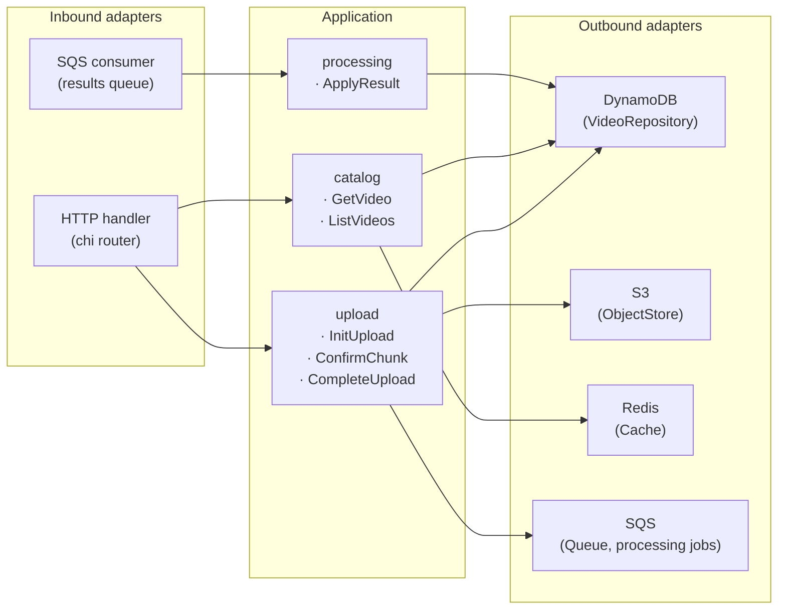
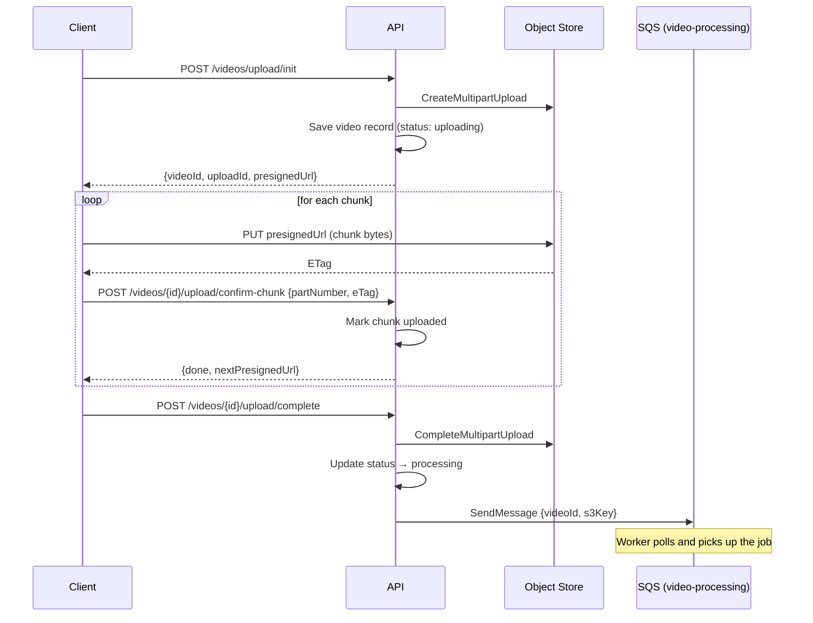
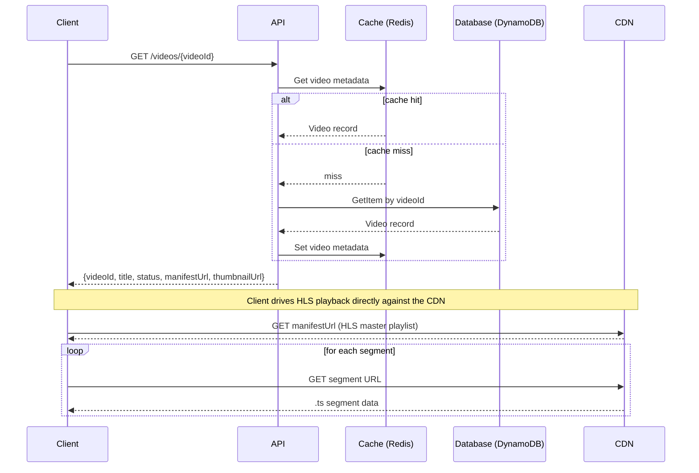
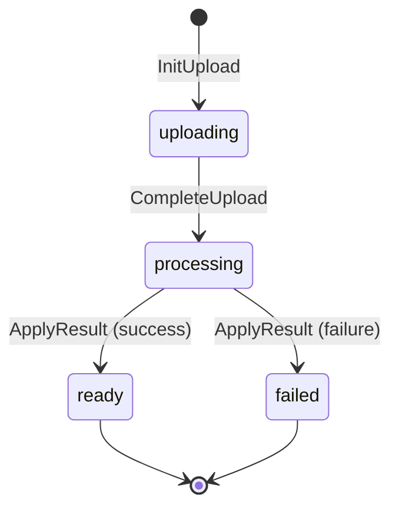

# API

REST API for the design-youtube platform. Handles video uploads via S3 presigned multipart URLs, tracks video metadata in DynamoDB, caches presigned URLs in Redis, and consumes processing results from the worker over SQS.

Built with Go using hexagonal (ports and adapters) architecture. HTTP routes are generated from the OpenAPI spec with [oapi-codegen](https://github.com/oapi-codegen/oapi-codegen).

## Architecture



## API Endpoints

### Catalog

| Method | Path | Description |
|--------|------|-------------|
| `GET` | `/videos` | List all ready videos |
| `GET` | `/videos/{videoId}` | Get video metadata and streaming URL |

### Upload

Requires `X-Upload-Secret` header on all upload endpoints.

| Method | Path | Description |
|--------|------|-------------|
| `POST` | `/videos/upload/init` | Initiate or resume a multipart upload |
| `POST` | `/videos/{videoId}/upload/confirm-chunk` | Confirm a chunk and receive the next presigned URL |
| `POST` | `/videos/{videoId}/upload/complete` | Finalise the multipart upload |

Full spec: [`api/openapi.yaml`](api/openapi.yaml)

## Upload Flow



## Get / Stream Video Flow



## Video Status Lifecycle



## Configuration

| Variable | Description |
|----------|-------------|
| `UPLOAD_SECRET` | Shared secret required for upload endpoints |
| `AWS_REGION` | AWS region |
| `DYNAMODB_TABLE` | DynamoDB table name |
| `S3_BUCKET` | S3 bucket for video storage |
| `CLOUDFRONT_DOMAIN` | CloudFront domain for serving assets |
| `SQS_QUEUE_URL` | SQS URL for dispatching processing jobs |
| `RESULTS_QUEUE_URL` | SQS URL for consuming processing results |
| `REDIS_ADDR` | Redis address (`host:port`) |
| `AWS_ENDPOINT_URL` | Override AWS endpoint (LocalStack in dev) |
| `S3_USE_PATH_STYLE` | Use path-style S3 addressing (`true` for LocalStack, unset/`false` in production) |
| `S3_PUBLIC_ENDPOINT_URL` | Rewrite presigned URL host to this endpoint (browser-accessible LocalStack URL) |
| `CORS_ALLOWED_ORIGINS` | Comma-separated list of allowed CORS origins for upload endpoints |

## Development

Run the full stack:

```bash
# From repo root
docker compose up --build
```

Run tests:

```bash
go test ./...
```

Regenerate OpenAPI server code after editing `api/openapi.yaml`:

```bash
go generate ./api/...
```

Regenerate mocks after changing port interfaces:

```bash
mockery
```
