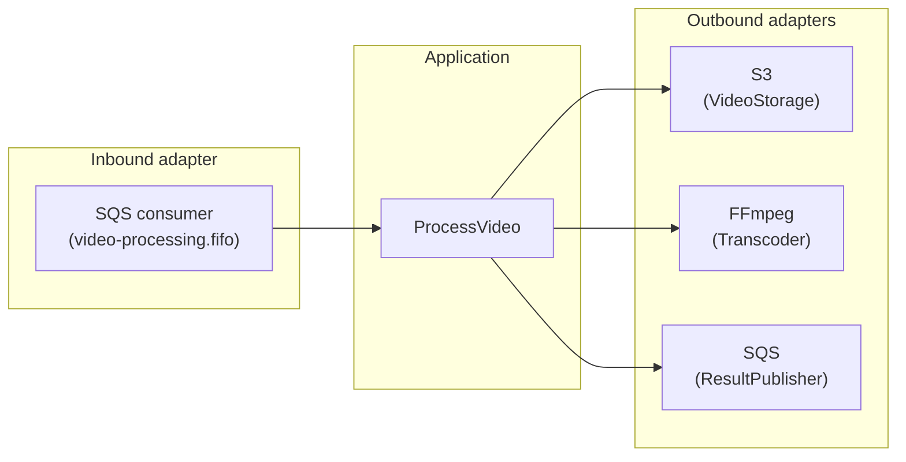
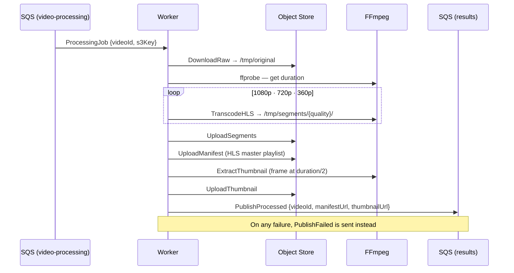

# Worker

Async video processing service for the design-youtube platform. Polls the `video-processing` SQS FIFO queue, downloads raw uploads from S3, transcodes them to HLS at three resolutions using FFmpeg, uploads the segments and master manifest back to S3, and publishes the result to `video-processing-results` for the API to consume.

Built with Go using hexagonal (ports and adapters) architecture.

## Architecture



## Processing Pipeline



## Output Qualities

| Quality | Resolution | Bitrate |
|---------|-----------|---------|
| 1080p | 1920×1080 | 4000 kbps |
| 720p | 1280×720 | 2500 kbps |
| 360p | 640×360 | 800 kbps |

## Configuration

| Variable | Description |
|----------|-------------|
| `AWS_REGION` | AWS region |
| `S3_BUCKET` | S3 bucket for video storage |
| `CLOUDFRONT_DOMAIN` | CloudFront domain used in published asset URLs |
| `SQS_QUEUE_URL` | SQS URL to poll for processing jobs |
| `RESULTS_QUEUE_URL` | SQS URL to publish results to |
| `S3_ENDPOINT_URL` | Override S3 endpoint (e.g. `http://minio:9000` for local dev); unset in production |
| `S3_PUBLIC_URL` | Publish `manifestUrl`/`thumbnailUrl` as `{S3_PUBLIC_URL}/{bucket}/{key}` (e.g. `http://localhost:9000`); unset in production to use `CLOUDFRONT_DOMAIN` |
| `SQS_ENDPOINT_URL` | Override SQS endpoint (e.g. `http://elasticmq:9324`); unset in production |

## Development

Run the full stack:

```bash
# From repo root
docker compose up --build
```

Run tests:

```bash
go test ./...
```

Regenerate mocks after changing port interfaces:

```bash
mockery
```
