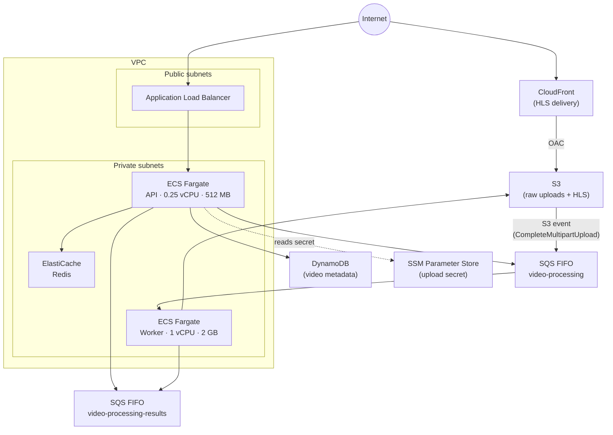

# AWS Infrastructure

Terraform configuration for the design-youtube platform, targeting AWS (us-east-1 by default).

## Architecture



## Resources

| Resource | Purpose |
|----------|---------|
| VPC | Isolated network with public and private subnets across two AZs |
| Application Load Balancer | Public entry point for the API (port 80) |
| ECS Fargate — API | Runs the API container; 0.25 vCPU, 512 MB |
| ECS Fargate — Worker | Runs the worker container; 1 vCPU, 2 GB |
| S3 | Raw video uploads (`raw/`) and transcoded HLS segments, manifests, thumbnails |
| DynamoDB | Video metadata table with GSI on `status + uploadedAt` (on-demand billing) |
| ElastiCache Redis | Presigned URL cache for the API |
| SQS FIFO `video-processing` | Upload-complete events from S3 → worker |
| SQS FIFO `video-processing-results` | Processing results from worker → API |
| CloudFront | CDN for HLS segments and thumbnails; short TTL on manifests (5 s default) |
| SSM Parameter Store | `UPLOAD_SECRET` stored as SecureString; injected into the API container at runtime |
| CloudWatch Logs | Log groups for API and worker ECS tasks (7-day retention) |

## Deploying

Prerequisites: Terraform ≥ 1.6, AWS credentials with sufficient IAM permissions.

```bash
cd infra/aws

# Initialise with your S3 backend
terraform init -backend-config=backend.tfbackend

# Preview changes
terraform plan

# Apply
terraform apply
```

After `apply`, set a real value for the upload secret — Terraform creates the parameter with a placeholder:

```bash
aws ssm put-parameter \
  --name "/design-youtube/upload-secret" \
  --value "<your-secret>" \
  --type SecureString \
  --overwrite
```

Then force a new ECS deployment so the API container picks up the updated secret:

```bash
aws ecs update-service \
  --cluster design-youtube \
  --service design-youtube-api \
  --force-new-deployment
```

## State Backend

Remote state is stored in S3. Create a `backend.tfbackend` file (this file is gitignored):

```hcl
bucket = "your-tf-state-bucket"
key    = "design-youtube/terraform.tfstate"
region = "us-east-1"
```

## Variables

| Variable | Default | Description |
|----------|---------|-------------|
| `aws_region` | `us-east-1` | Target AWS region |
| `environment` | `prod` | Environment tag applied to all resources |
| `project` | `design-youtube` | Project name used in resource names and tags |
